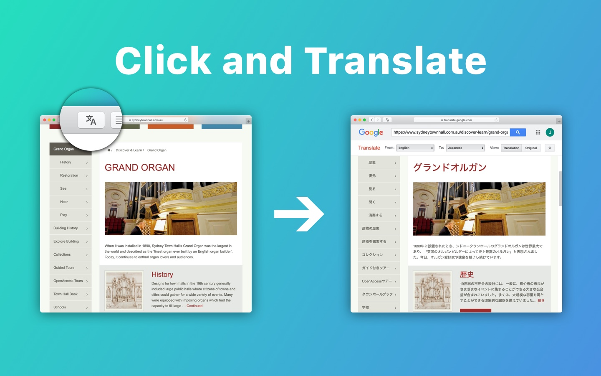
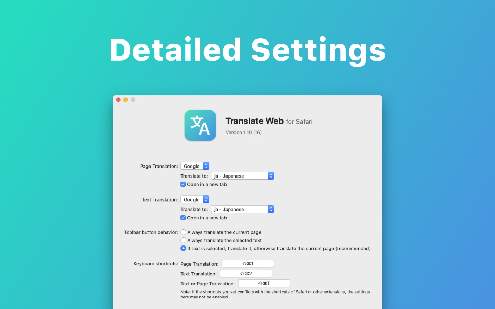

# Translate Web For Safari

This is a Safari extension that translates the current tab or selected text.

You can get this extension from:

-  or
- [Releases on Github](https://github.com/mshibanami/TranslateWebForSafari/releases) (FREE)

Please feel free to send a feedback if you found a problem.

## Acknowledgements

- [Kentzo / ShortcutRecorder](https://github.com/Kentzo/ShortcutRecorder)

## Licence

[MIT](LICENSE)
